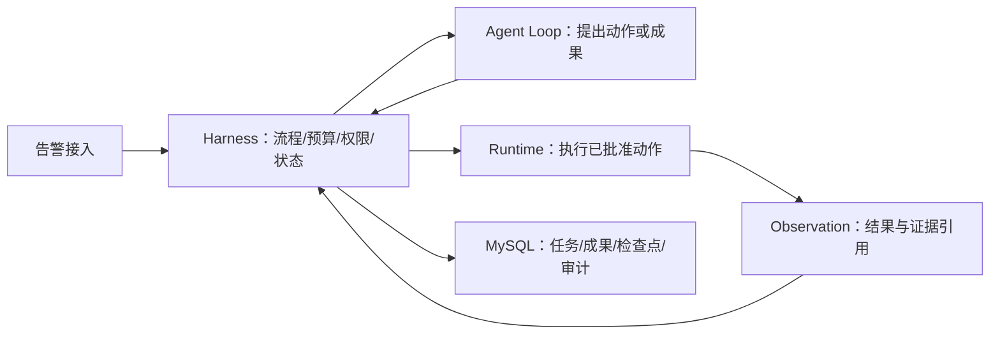

# 飞书规格与当前代码对照

核对日期：2026-09-25。来源：[自进化+Harness项目 1：告警助手代码级文档](https://ccnyzfdxyyhs.feishu.cn/wiki/CKgyw2OqlixhgMkCs8ecle42nle)，CLI 返回正文文档 ID `BL4gdmRsboVuSwxt996cOGr4nfK`，首次目录读取 revision 为 772。正文是后续读取的最新版本。本文件记录本地源码核查，不代表文档里的所有目标已经实现。

## 最关键的边界变化

飞书规格明确：Agent Loop（智能体循环）提出动作，Harness（编排控制层）控制流程和状态，Runtime（受控执行环境）执行动作并返回 Observation（执行观察结果）。当前 `EventDrivenAgentRuntimeService` 仍承担黑板协作编排，因此类名不能直接对应新规格的 Runtime。

以上是目标架构图，当前调用入口应从 `app/api/routes.py` 阅读：Webhook 进入 `AlertIngestService`；对话入口进入 `ChatService` 和 `AlertAgentHarness`。两条路径尚未统一为文档规定的 Incident 任务执行流程。

## 实现对照

| 文档章节/能力 | 当前入口 | 当前状态和缺口 |
| --- | --- | --- |
| 0 全局配置 | `app/core/config.py`、`.env.example` | 已有环境配置；未实现 Incident 冻结 config/skill/knowledge/context 版本的统一合同 |
| 2 告警模型与 P0-P3 | `app/core/enums.py`、`app/services/alerting.py` | 已有四类类型与优先级归一、事件聚合；需对照外部优先级不可被模型修改的全部路径 |
| 3 模型与预算 | `app/services/ai.py`、`agent_models.py` | 已有模型适配；文档的 DeepSeek/Qwen 配置、逐 Incident 累计预算和硬门槛未整体验收 |
| 5-7 Loop/Harness/Runtime | `app/agents/harness.py`、`event_driven_runtime.py`、`app/sandbox/sandbox.py` | 现有职责与新规格不同；需拆分 Action/Observation 执行合同，统一 Harness 控制 |
| 8 黑板与 Claim | `app/agents/events.py`、`coordinator.py`、`registry.py` | 有进程内任务/成果/事件；Redis 原子租约、心跳、重建和持久化检查点未完成 |
| 9 专家 Agent | `app/agents/autonomous.py`、`app/services/mcp_client.py` | 已有通用协作基础；日志、链路、指标、变更、代码等真实数据源闭环尚需接入 |
| 10 上下文 | `app/services/memory.py` | 已有脱敏、近期窗口和摘要；强证据字段保留与逐类型 Token 硬预算需补齐 |
| 11 记忆 | `app/services/memory.py`、`app/agents/harness.py` | 对话 Harness 当前只写 Redis；没有 ChatSession/ChatMessage 表，不能宣称完整历史从 MySQL 回填 |
| 12 RAG | `app/services/knowledge.py`、`vector_store.py` | 已有本地检索与可选向量组件；文档要求的 Elasticsearch 双路、权限前过滤、Qwen 重排与版本治理未完整实现 |
| 13 Skills | `skills/alert_triage`、`skills/runbook_response`、`app/services/skills.py` | 两份通用技能及元数据校验；四类流程技能、能力技能、脚本合同与版本发布需补齐 |
| 14 MCP | `app/mcp_tools/server.py`、`app/services/tool_governance.py` | 有工具接口与治理基础；生产工具白名单和参数权限需要端到端验收 |
| 15 队列 | `app/services/tool_queue.py` | 当前 MySQL 任务扫描及线程池；未实现文档的四级 Redis ZSET、原子 Claim 和租约抢占规则 |
| 16 数据 | `app/models/entities.py` | 已有告警、事件、工具任务、轨迹等表；新 Task/Artifact/Checkpoint 持久化合同需补齐 |
| 17 权限 | `app/core/security.py`、`app/core/bootstrap.py` | 有 Basic/角色检查；不等于 tenant/environment/service 维度的 RBAC+ABAC 隔离 |
| 18 报告 | `app/services/report.py`、`trace.py` | 有报告与轨迹基础；每项事实引用有效证据、冲突证据保留及强制验收需补齐 |
| 19/21 数据与评测 | `app/rag_eval`、`tests`、`app/harness/runner.py` | 有 100 条中文样例；未形成文档要求的 100 条冻结工具结果金标回放集 |
| 13.8 自进化 | Skill 文件与规格说明 | 未形成候选、离线评测、影子流量、审批、灰度和回滚闭环 |
| 28 部署 | `Dockerfile`、`docker-compose.yml` | 有 MySQL/Redis/app 配置；未验证文档的 4 核 8G 容量或 70-80 人并发 |

## 规格自身需要统一的条目

按文档第 0 章“单一约束来源”执行实现决策，并记录以下不一致：

1. 第 0 章 Coordinator 仅提出计划、不能直接执行工具；0.1 又列出其工具权限，后续章节还描述其直接维护状态。应统一为 Harness 读取上下文、执行提案，Coordinator 输出建议。
2. 第 0 章重排主模型为 4B；12.8.1 标题写 0.6B。按主模型 4B、降级 0.6B 的配置合同解释，真实服务未接入前不报告模型效果。
3. Skill 示例目录为 `problem-alert`，元数据名为 `problem-alert-skill`；当前 Registry 要求目录名与 name 相同。新增代码包需统一名称后再启用。
4. 第 0 章 R2 写为 Safety+白名单，其他段落又要求 R2/R3 人审。写工具启用前必须统一动作级审批规则。
5. 文档描述四条优先级队列，同时给出混合优先级 score 公式。实现时应明确为逐级取队列、同级按到达时间排序，并用原子领取测试验证，避免数值编码导致优先级交叉。

## 后续实施顺序与验收

1. 固定配置和 Action/Observation/Artifact Schema；补一个 P0 下单失败的冻结证据样例，从输入到报告可离线回放。
2. 建立统一 Harness、只读执行 Runtime、四类 Skill；验证无证据只能输出假设、动作越权被拒绝、模型/工具失败能收敛。
3. MySQL 持久化 Task/Artifact/Checkpoint；Redis 原子租约、心跳和优先队列；验证重启恢复、并发不重复领取、P0 优先。
4. 将工程 Harness 改为专用 MySQL 测试库，补租户与环境隔离、受限代码分析、真实工具适配和检索权限测试。
5. 完成 100 条人工审核金标、检索模型评测、故障注入及容量测试，再发布文档规格对应版本。

本次交付解决源码可分发、目录可读、配置与演示数据齐全及差距可核对的问题。后续功能点补测已达 114 passed、3 skipped，详见 [测试对照](testing.md)。生产规格实现依照上述顺序继续推进，单测不能替代完整生产验收。
